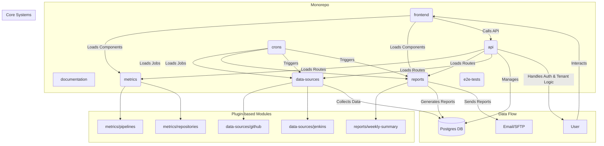

# System Architecture

This project uses a monorepo architecture managed with npm workspaces. The structure is designed to be modular and scalable, supporting a plugin-based approach for metrics, data sources, and reports.

## High-Level Diagram

## Core Concepts

-   **Monorepo:** All code is contained in a single repository, managed as distinct packages using npm workspaces. This simplifies dependency management and cross-package development.
-   **Plugin Architecture:** `metrics`, `data-sources`, and `reports` are not just folders but collections of self-contained packages. The core systems (`api`, `frontend`, `crons`) are designed to dynamically discover and integrate these packages. For example, the API server will automatically load any route definitions found in `metrics/*/api`.
-   **Multi-Tenancy:** For the SaaS version, each client (tenant) has their own isolated database. A central `main` database stores tenant metadata, including connection details, allowing the API to switch database connections dynamically based on the authenticated user.
-   **Data Orchestration:** A core cron job acts as an orchestrator, managing the data collection lifecycle. It uses a dependency graph to ensure data sources are polled in the correct order and tracks collection windows to gather data incrementally.
