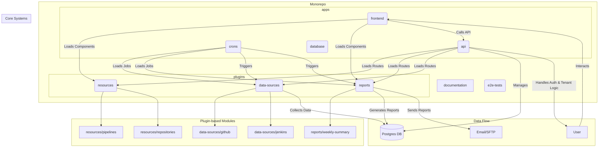
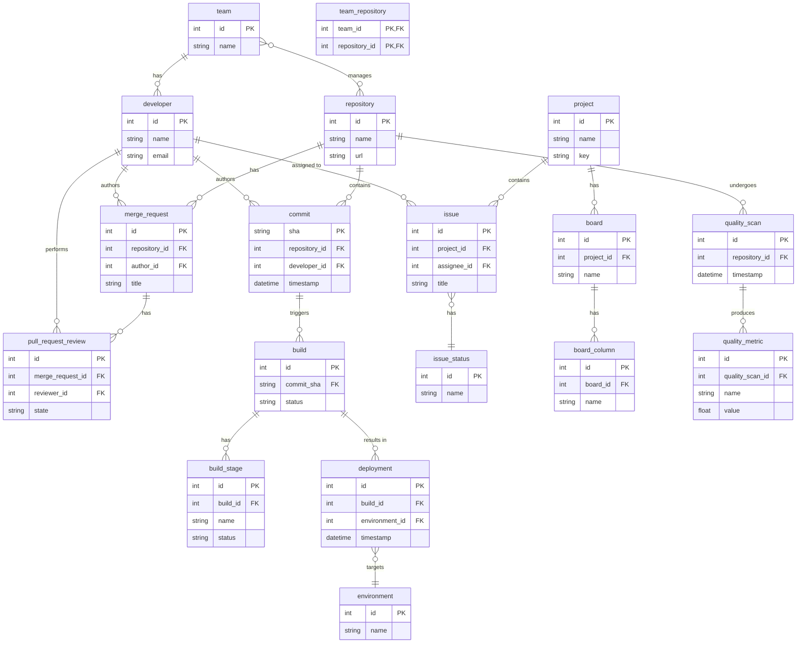

# System Architecture

This project uses a monorepo architecture managed with npm workspaces. The structure is designed to be modular and scalable, supporting a plugin-based approach for metrics, data sources, and reports.

## High-Level Diagram

## Core Concepts

-   **Monorepo:** All code is contained in a single repository, managed as distinct packages using npm workspaces. This simplifies dependency management and cross-package development.
-   **Plugin Architecture:** The `plugins` directory contains collections of self-contained packages for `resources`, `data-sources`, and `reports`.
    -   **Resources:** Define the core data models of the platform (e.g., `Team`, `Repository`). They are responsible for the database schema (via a local `db/schema.prisma`) and exposing CRUD API endpoints.
    -   **Data Sources:** Responsible for collecting data from external systems (e.g., GitHub, Jira) and ingesting it into the appropriate resource schemas. They are managed by the `crons` application.
    -   **Reports:** Process the data from resources to generate insights and analytics.
-   The core systems (`api`, `frontend`, `crons`) in the `apps` directory are designed to dynamically discover and integrate these packages. For example, the API server will automatically load any route definitions found in `plugins/resources/*/api`.
-   **Multi-Tenancy:** For the SaaS version, each client (tenant) has their own isolated database. A central `main` database stores tenant metadata, including connection details, allowing the API to switch database connections dynamically based on the authenticated user.
-   **Data Orchestration:** A core cron job acts as an orchestrator, managing the data collection lifecycle. It uses a dependency graph to ensure data sources are polled in the correct order and tracks collection windows to gather data incrementally.

## Data Model

The following diagram illustrates the core entities of the system and their relationships. Each entity will be implemented as a separate resource plugin.

