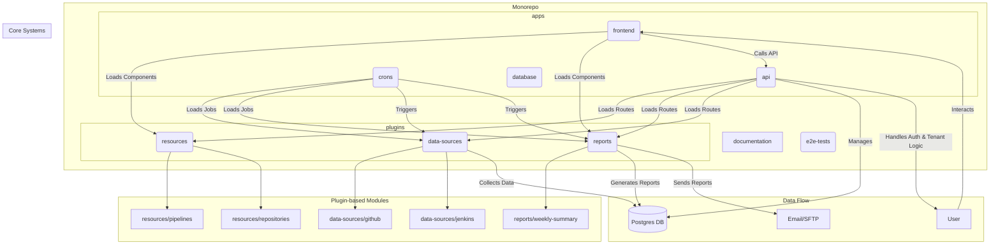
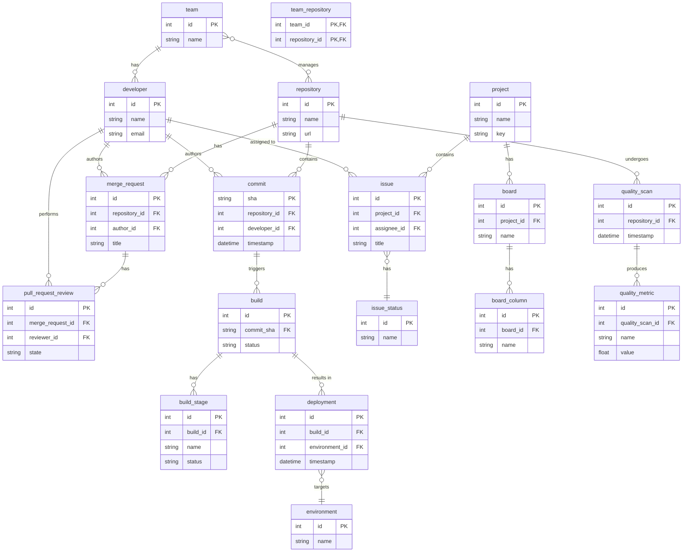

# System Architecture

This project uses a monorepo architecture managed with npm workspaces. The structure is designed to be modular and scalable, supporting a plugin-based approach for metrics, data sources, and reports.

## High-Level Diagram



## Core Concepts

-   **Monorepo:** All code is contained in a single repository, managed as distinct packages using npm workspaces. This simplifies dependency management and cross-package development.
-   **Plugin Architecture:** The `plugins` directory contains collections of self-contained packages for `resources`, `data-sources`, and `reports`.
    -   **Resources:** Define the core data models of the platform (e.g., `Team`, `Repository`). They are responsible for the database schema (via a local `db/schema.prisma`) and exposing CRUD API endpoints.
    -   **Data Sources:** Responsible for collecting data from external systems (e.g., GitHub, Jira) and ingesting it into the appropriate resource schemas. They are managed by the `crons` application.
    -   **Reports:** Process the data from resources to generate insights and analytics.
-   The core systems (`api`, `frontend`, `crons`) in the `apps` directory are designed to dynamically discover and integrate these packages. For example, the API server will automatically load any route definitions found in `plugins/resources/*/api`.
-   **Multi-Tenancy:** For the SaaS version, all tenants share a single database with data isolation achieved through tenant_id filtering. Each request is authenticated and associated with a tenant context, ensuring proper data isolation in all queries.
-   **Tenant-Based Data Orchestration:** A core cron job acts as an orchestrator, managing the data collection lifecycle per tenant. It uses tenant-specific configuration from TenantDataSourceConfig to determine which data sources to run, builds dependency graphs per tenant, and tracks collection windows for incremental data gathering with proper concurrency control.

## Tenant-Based Data Collection Architecture

### Data Collection Flow

```mermaid
graph TD
    subgraph "Cron Orchestrator"
        A[Load TenantDataSourceConfig] --> B[Group by Tenant + DataSource]
        B --> C[Build Environment Objects]
        C --> D[Scan Data Source Plugins]
        D --> E[Build Dependency Graph per Tenant]
        E --> F[Execute with p-graph]
    end
    
    subgraph "Per-Tenant Execution"
        F --> G[SELECT FOR UPDATE ... SKIP LOCKED]
        G --> H[Calculate Date Range]
        H --> I[Run Data Source Plugin]
        I --> J[Update DataSourceRun]
    end
    
    subgraph "Data Source Plugin"
        I --> K[run(env, db, tenantId, startDate, endDate)]
        K --> L[Collect Data from External API]
        L --> M[Upsert to Database]
    end
    
    subgraph "Concurrency Control"
        G --> N[Lock: tenantId + dataSource + script]
        N --> O[Skip if already locked]
        O --> P[Process next available]
    end
```

### Key Components

1. **TenantDataSourceConfig**: Stores tenant-specific configuration as key-value pairs
   - `tenantId`: Which tenant this config belongs to
   - `dataSource`: Data source identifier (e.g., "github", "jira")
   - `key`/`value`: Environment variables needed by the data source

2. **DataSourceRun**: Tracks execution history per tenant
   - `tenantId`: Tenant isolation
   - `dataSource`: Source system (e.g., "github")
   - `script`: Specific script within source (e.g., "repository.ts")
   - `lastFetchedDataDate`: For incremental collection

3. **Data Source Plugin Interface**:
   ```typescript
   // Required exports
   export const resources: string[] = ["repository"];
   export const dependencies: string[] = ["commit"]; // optional
   export const importWindowDuration = 86400 * 1000; // optional, default 24h
   
   // Main execution function
   export async function run(
     env: Record<string, string>,
     db: PrismaClient,
     tenantId: string,
     startDate: Date,
     endDate: Date
   ): Promise<void>
   ```

4. **Incremental Collection**:
   - Uses `lastFetchedDataDate` from DataSourceRun to determine start date
   - Defaults to 90 days ago for first runs
   - Respects `importWindowDuration` for window size
   - Handles failures by allowing retries on subsequent runs

5. **Concurrency Control**:
   - Uses `SELECT FOR UPDATE ... SKIP LOCKED` on DataSourceRun
   - Prevents multiple executions of same tenant + dataSource + script
   - Allows parallel execution of different combinations

### Tenant Isolation Benefits

- **Configuration Isolation**: Each tenant can have different data sources configured
- **Execution Isolation**: No coordination between tenants during data collection
- **Error Isolation**: Failures in one tenant don't affect others
- **Scalability**: Can process tenants in parallel with p-graph managing concurrency

## Data Model

The following diagram illustrates the core entities of the system and their relationships. Each entity will be implemented as a separate resource plugin.



### Code Quality Integration

The platform integrates with SonarQube for comprehensive code quality analysis. The `quality_scan` and `quality_metric` entities store data from static analysis tools:

- **SonarQube Integration**: Configured via `sonar-project.properties` with monorepo support
- **Automated Analysis**: GitHub Actions workflow runs SonarQube analysis on every PR and push
- **Quality Gates**: Configurable quality thresholds that must be met before merging
- **Metrics Collection**: Code complexity, coverage, security vulnerabilities, and technical debt metrics
- **Multi-Module Support**: Separate analysis for each application and plugin in the monorepo
- **CI/CD Integration**: Quality checks are enforced via GitHub Actions workflow with SonarQube quality gate checks
